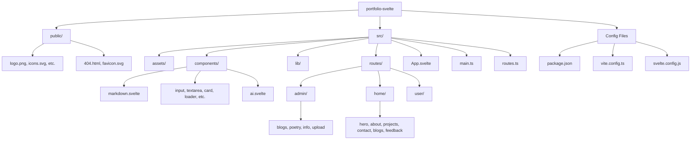

# RyannKim327 Portfolio

**Project version:** `4.3.4`

[](https://wakatime.com/badge/user/61954829-dd88-47de-8b67-7d673663ea1c/project/da79e6a7-f448-49fd-8ce7-d643023e18b8)


> **A modern, responsive portfolio website showcasing the work and skills of Ryann Kim Sesgundo, an aspiring full-stack developer.**

## Table of Contents

- [🚀 Live Demo](#-live-demo)
- [✨ Features](#-features)
- [🛠️ Tech Stack](#tech-stack)
  - [Frontend](#frontend)
  - [Backend](#backend)
  - [Libraries & Tools](#libraries--tools)
- [📁 Project Structure](#-project-structure)
- [🚀 Getting Started](#-getting-started)
  - [Prerequisites](#prerequisites)
  - [Installation](#installation)
  - [Available Scripts](#available-scripts)
- [🎨 Design Philosophy](#-design-philosophy)
- [📝 Changelog](#-changelog)
- [🌐 Deployment](#-deployment)
- [🔗 Backend Integration](#-backend-integration)
- [📝 About the Developer](#-about-the-developer)
- [🤝 Contributing](#-contributing)
- [📄 License](#-license)
- [🙏 Acknowledgments](#-acknowledgments)
- [🔧 Technical Details](#-technical-details)

## 🚀 Live Demo

Visit the live portfolio at: [ryannkim327.is-a.dev](https://ryannkim327.is-a.dev)

## ✨ Features

- 🎨 **Modern Svelte 5 Design** - Clean, professional layout leveraging Svelte 5's fine-grained reactivity (Runes)
- ✨ **Tech & Aesthetics** - Immersive animated background and a standardized, blurred-card UI across the entire site
- 📱 **Fully Responsive** - Optimized for desktop, tablet, and mobile devices
- ⚡ **Lightning Fast** - Built with Vite 8 for optimal development and production performance
- 🎯 **TypeScript** - Type-safe development for better code quality and maintenance
- 🎨 **Tailwind CSS 4.3** - Utility-first CSS framework for rapid and consistent styling
- 📦 **Component-Based Architecture** - Modular and maintainable code structure in Svelte
- 🌙 **Dark/Light Theme** - Elegant theme switching with dark and light modes, featuring purple accents
- 📊 **Wakatime Integration** - Real-time coding activity and statistics integrated via API
- 📝 **Markdown Support** - Integrated `marked` and `dompurify` for secure Markdown rendering in Blogs and Poetry
- 👣 **Professional Footer** - Modern footer component with dynamic year and branding
- 🔔 **Toast Notifications** - Real-time feedback using `svelte-french-toast`
- 🤖 **AI Assistant** - Integrated AI component for interactive user engagement and assistance
- 🧰 **Admin Dashboard** - Comprehensive dashboard to manage blogs, poetry, and professional info with a unified modern aesthetic
- 📤 **File Uploads** - Integrated file upload functionality for media management within the Admin dashboard
- 🐙 **GitHub Integration** - Automated project fetching and syncing using the GitHub API
- 🔗 **Backend Integration** - Connected to a custom Go-based backend API

## 🛠️ Tech Stack

### Frontend

- **Svelte 5.55.5** - Reactive and compiler-optimized frontend framework using Runes
- **TypeScript 6.0.3** - Static type checking for robust applications
- **Vite 8.0.12** - Next-generation frontend tooling for fast builds
- **Tailwind CSS 4.3.0** - Utility-first CSS framework for modern design

### Backend

- **Go** - High-performance backend API server
- **Repository**: [portfolio-backend](https://github.com/RyannKim327/portfolio-backend)

### Libraries & Tools

- **marked (18.0.3)** - Fast Markdown parser and compiler
- **dompurify (3.4.3)** - XSS sanitizer for HTML and Markdown
- **svelte-french-toast (1.2.0)** - Lightweight toast notifications for Svelte
- **svelte-spa-router (5.1.0)** - Simple hash-based routing for Svelte apps
- **Axios (1.16.1)** - Promise-based HTTP client for API communication
- **gh-pages (6.3.0)** - Easy deployment to GitHub Pages
- **svelte-awesome** - Font Awesome icons for Svelte

## 📁 Project Structure



```
portfolio-svelte/
├── public/                 # Static assets (icons, 404, fonts, etc.)
├── src/
│   ├── assets/            # Project-specific images and logos
│   ├── components/        # Reusable Svelte components (AI, Markdown, UI)
│   ├── lib/               # Shared logic, storage, and fetch utilities
│   ├── routes/            # Main views (Admin, Home sections, User views)
│   ├── App.svelte         # Root Svelte component
│   ├── main.ts            # Entry point
│   └── routes.ts          # SPA routing configuration
└── package.json           # Dependencies and scripts
```

## 🚀 Getting Started

### Prerequisites

- **Node.js** (latest LTS recommended)
- **npm**

### Installation

1. Clone the repository:
   ```bash
   git clone https://github.com/RyannKim327/portfolio-svelte.git
   ```
2. Navigate to the project directory:
   ```bash
   cd portfolio-svelte
   ```
3. Install dependencies:
   ```bash
   npm install
   ```

### Available Scripts

- `npm run dev` - Start development server
- `npm run build` - Build for production
- `npm run check` - Run Svelte and TypeScript checks
- `npm run deploy` - Manual build and deploy to GitHub Pages

## 🎨 Design Philosophy

- **Modern Aesthetic**: Clean lines, ample whitespace, and a focus on content clarity.
- **Tech-Driven Aesthetics**: Immersive, subtle animations like drifting radials and tech grids that evoke a "high-tech" feel without sacrificing performance or usability.
- **Purple Accents**: A consistent color palette featuring purple highlights to provide a distinct and professional look.
- **Interactive Feedback**: Soft transitions and hover effects that provide immediate visual confirmation and a "fluid" user experience.
- **Dark/Light Mode**: User-selectable themes to ensure comfortable viewing in any environment, with refined styling and animation visibility for both modes.
- **Responsive Design**: Fluid layouts that adapt seamlessly from mobile devices to large desktop monitors.

## 📝 Changelog

Detailed version history can be found in [CHANGELOGS.md](./CHANGELOGS.md).

## 🌐 Deployment

The project is configured for automated deployment:
- **Hosting**: GitHub Pages
- **Domain**: [ryannkim327.is-a.dev](https://ryannkim327.is-a.dev)
- **CI/CD**: GitHub Actions workflow (`gh-pages.yml`) automates the build and deployment process on every push to the `main` branch.

## 🔗 Backend Integration

This frontend interacts with a custom-built backend:
- **API**: Go-based REST API
- **Functionality**: Dynamic fetching of blog posts, project details, feedback, and professional experiences.
- **Source**: [portfolio-backend](https://github.com/RyannKim327/portfolio-backend)

## 📝 About the Developer

**Ryann Kim M. Sesgundo** is an aspiring full-stack developer passionate about building modern web applications. With a focus on performance and user experience, Ryann Kim continuously explores new technologies like Svelte, Go, and TypeScript to create impactful digital solutions.

## 🤝 Contributing

Contributions are welcome!
1. Fork the Project
2. Create your Feature Branch (`git checkout -b feature/AmazingFeature`)
3. Commit your Changes (`git commit -m 'Add some AmazingFeature'`)
4. Push to the Branch (`git push origin feature/AmazingFeature`)
5. Open a Pull Request

## 📄 License

Distributed under the MIT License. See [LICENSE.md](./LICENSE.md) for more information.

## 🙏 Acknowledgments

- **Vite** for the lightning-fast build tool
- **Svelte** for the intuitive and powerful framework
- **Tailwind CSS** for making styling efficient and consistent
- **Go** for the robust backend API

## 🔧 Technical Details

- **Svelte 5 Runes**: Leverages the latest "Runes" system (`$state`, `$derived`, `$effect`) for fine-grained reactivity and better performance.
- **Tailwind CSS 4**: Utilizes the latest version of Tailwind for streamlined styling and improved build times.
- **Vite 8**: Ensures a lightning-fast development experience and optimized production bundles.
- **SPA Architecture**: Uses `svelte-spa-router` for a smooth, single-page application experience without page reloads.
- **Admin Security**: Implements an `Admin Code` verification gate and specialized fetch utilities for secure content management.
- **CI/CD**: Integrated GitHub Actions for automated deployment, ensuring the live site is always up-to-date with the latest changes.
