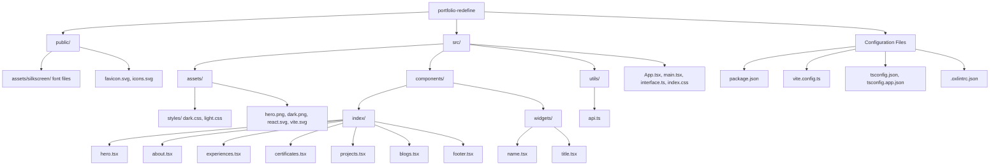

# RyannKim327 Portfolio


[](https://wakatime.com/badge/user/61954829-dd88-47de-8b67-7d673663ea1c/project/da79e6a7-f448-49fd-8ce7-d643023e18b8)


[](https://github.com/RyannKim327/ryannkim327.github.io/actions/workflows/gh-pages.yml)

> **A redefined, retro-modern personal portfolio showcasing the work, skills, and projects of Ryann Kim M. Sesgundo, built with React 19, Tailwind CSS 4, and Vite.**

---

## Table of Contents

- [🚀 Live Demo](#-live-demo)
- [✨ Features](#-Features)
- [🛠️ Tech Stack](#-tech-stack)
  - [Frontend](#frontend)
  - [Backend](#backend)
  - [Tooling & Libraries](#tooling-libraries)
- [📁 Project Structure](#-project-structure)
- [🚀 Getting Started](#-getting-started)
  - [Prerequisites](#prerequisites)
  - [Installation](#installation)
  - [Available Scripts](#available-scripts)
- [🎨 Design & Aesthetics](#-design-aesthetics)
- [🔗 Backend Integration](#-backend-integration)
- [📝 About the Developer](#-about-the-developer)
- [🤝 Contributing](#-contributing)
- [📄 License](#-license)
- [🙏 Acknowledgments](#-acknowledgments)
- [🔧 Technical Details](#-technical-details)

---

## 🚀 Live Demo

Visit the live portfolio at: [ryannkim327.is-a.dev](https://ryannkim327.is-a.dev)

---

## ✨ Features

- ⚛️ **Modern React 19 Foundation** - Re-engineered using React 19 and the React Compiler for automatic memoization and optimal rendering performance.
- 👾 **Retro-Modern Visual Identity** - Distinctive typography with the Silkscreen pixel font and bold 3D isometric text depth effects.
- 🎨 **Tailwind CSS 4 System** - Powered by Tailwind CSS v4 `@theme inline` design tokens with system-aware dark and light themes (`prefers-color-scheme`).
- ⚡ **Lightning Fast Tooling** - Supercharged by Vite 8 and Oxlint for high-speed builds and near-instant linting.
- 📜 **Parallax & Scroll Interactions** - Fixed typography background (`Name` widget) combined with smooth vertical scrolling content layers and animated scroll prompts.
- 💼 **Experience Timeline** - Chronological career history with sticky category headings and styled terminal-style bullet points.
- 🏆 **Certificates Showcase** - Interactive certificates gallery with dynamic asset retrieval, category indicators, and external verification links.
- 🗂️ **Dynamic Project Showcase** - Randomly shuffled project highlights featuring smooth grayscale-to-color hover transitions and direct asset retrieval.
- 📰 **Blog Highlights** - Preview cards displaying recent blog write-ups and insights.
- 📱 **Fully Responsive** - Designed from the ground up to provide seamless viewing across mobile, tablet, and ultra-wide displays.
- 📬 **Interactive Footer & Contact** - Direct message input form alongside quick-access social links and dynamic copyright year.

---

## 🛠️ Tech Stack

### Frontend

- **React 19.2** - Modern component-based UI framework
- **TypeScript 6.0** - End-to-end static type safety
- **Tailwind CSS 4.3** - Modern CSS framework with native `@theme inline` variables
- **React Router 8.3** - Client-side routing support
- **React Compiler** - Automated optimization and memoization via Babel preset

### Backend

- **Go REST API** - High-performance backend handling dynamic content, certificates, projects, blogs, and experience records
- **Repository**: [portfolio-backend](https://github.com/RyannKim327/portfolio-backend)

### Tooling & Libraries

- **Vite 8.2** - Next-generation development server and production bundler
- **Oxlint 1.75** - High-performance Rust-based JavaScript / TypeScript linter
- **Axios 1.19** & **tough-cookie** / **axios-cookiejar-support** - Robust HTTP client with cookie management
- **Silkscreen Font** - Retro arcade pixel typography

---

## 📁 Project Structure


```mermaid
graph TD
    Root[portfolio-redefine] --> Public[public/]
    Root --> Src[src/]
    Root --> Config[Configuration Files]

    Public --> P_Silkscreen[assets/silkscreen/ font files]
    Public --> P_Static[favicon.svg, icons.svg]

    Src --> Assets[assets/]
    Src --> Components[components/]
    Src --> Utils[utils/]
    Src --> Core[App.tsx, main.tsx, interface.ts, index.css]

    Assets --> Styles[styles/ dark.css, light.css]
    Assets --> Img[hero.png, dark.png, react.svg, vite.svg]

    Components --> C_Index[index/]
    Components --> C_Widgets[widgets/]

    C_Index --> C_Hero[hero.tsx]
    C_Index --> C_About[about.tsx]
    C_Index --> C_Exp[experiences.tsx]
    C_Index --> C_Certs[certificates.tsx]
    C_Index --> C_Projects[projects.tsx]
    C_Index --> C_Blogs[blogs.tsx]
    C_Index --> C_Footer[footer.tsx]

    C_Widgets --> W_Name[name.tsx]
    C_Widgets --> W_Title[title.tsx]

    Utils --> U_API[api.ts]

    Config --> C_Pkg[package.json]
    Config --> C_Vite[vite.config.ts]
    Config --> C_TS[tsconfig.json, tsconfig.app.json]
    Config --> C_Oxlint[.oxlintrc.json]
```

```
portfolio-redefine/
├── public/
│   ├── assets/
│   │   └── silkscreen/          # Silkscreen TTF font assets & license
│   ├── favicon.svg              # Site favicon
│   └── icons.svg                # Icon sprites
├── src/
│   ├── assets/
│   │   ├── styles/
│   │   │   ├── dark.css         # Dark theme color variables
│   │   │   └── light.css        # Light theme color variables
│   │   ├── dark.png             # Developer portrait asset
│   │   ├── hero.png             # Hero graphic asset
│   │   ├── react.svg
│   │   └── vite.svg
│   ├── components/
│   │   ├── index/               # Page section components
│   │   │   ├── about.tsx        # Bio and overview section
│   │   │   ├── blogs.tsx        # Recent blog posts grid
│   │   │   ├── certificates.tsx # Certificates showcase
│   │   │   ├── experiences.tsx  # Work & experience timeline
│   │   │   ├── footer.tsx       # Contact form & social footer
│   │   │   ├── hero.tsx         # Hero banner & scroll indicator
│   │   │   └── projects.tsx     # Filtered project showcase
│   │   └── widgets/             # Reusable UI widgets
│   │       ├── name.tsx         # 3D fixed background typography widget
│   │       └── title.tsx        # Sticky section title widget
│   ├── utils/
│   │   └── api.ts               # Centralized Axios API client & helpers
│   ├── App.tsx                  # Root application layout & parallel data loader
│   ├── index.css                # Global Tailwind CSS styles & animations
│   ├── interface.ts             # TypeScript interfaces and types
│   └── main.tsx                 # React DOM entry point
├── .oxlintrc.json               # Oxlint configuration
├── package.json                 # Project dependencies & npm scripts
├── tsconfig.json                # TypeScript root configuration
└── vite.config.ts               # Vite configuration with React & Tailwind plugins
```

---

## 🚀 Getting Started

### Prerequisites

- **Node.js** (v20+ recommended)
- **npm** (v10+ recommended)

### Installation

1. Clone the repository:
   ```bash
   git clone https://github.com/RyannKim327/ryannkim327.github.io.git
   ```
2. Navigate to the project directory:
   ```bash
   cd ryannkim327.github.io
   ```
3. Install dependencies:
   ```bash
   npm install
   ```

### Available Scripts

- `npm run dev` - Launch the Vite development server with HMR
- `npm run build` - Type-check with TypeScript and bundle for production
- `npm run lint` - Run Oxlint for ultra-fast codebase linting
- `npm run preview` - Preview the production build locally

---

## 🎨 Design & Aesthetics

- **Retro-Modern Typography**: Utilizes **Silkscreen** pixel font paired with monospace elements to evoke classic computing aesthetics.
- **3D Isometric Depth**: Custom CSS text shadow layers (`._3d`) create a bold visual hierarchy for the background nameplate.
- **Dynamic Offset Cards**: Bespoke offset shadow borders (`.card`) using customized theme colors for subtle retro framing.
- **System-Aware Themes**: Seamlessly switches between light and dark modes according to `prefers-color-scheme` with balanced high-contrast accents.
- **Fluid Layout**: Fully responsive CSS Grid and Flexbox layouts designed for all viewport breakpoints.

---

## 🔗 Backend Integration

The client communicates with the custom backend API:
- **Public Endpoints**: Retrieves experiences, certificates, projects, blog entries, developer bio, and Wakatime metrics.
- **Admin Support**: Includes helper utilities for authenticated API key actions (`adminGet`, `adminPost`, `adminPostMultipart`, `adminPut`).
- **Media Retrieval**: Centralized asset resolution helper (`retrieval`) for dynamically served server images.

---

## 📝 About the Developer

**Ryann Kim M. Sesgundo** is an Information Technology graduate and Full-Stack Developer specializing in modern web applications, automation scripting, and AI integration.

- **GitHub**: [@RyannKim327](https://github.com/RyannKim327)
- **Website**: [ryannkim327.is-a.dev](https://ryannkim327.is-a.dev)

---

## 🤝 Contributing

Contributions, issues, and feature requests are welcome!

1. Fork the repository
2. Create your branch (`git checkout -b feat/YourFeature`)
3. Commit your changes (`git commit -m 'feat: add some feature'`)
4. Push to the branch (`git push origin feat/YourFeature`)
5. Open a Pull Request

---

## 📄 License

This project is licensed under the **Creative Commons Attribution-NonCommercial 4.0 International License (CC BY-NC 4.0)**.

Copyright (c) 2024-2026 **Ryann Kim Sesgundo**

### Terms & Permissions:
- **Attribution** — You must give appropriate credit (Author: Ryann Kim Sesgundo, Source: [ryannkim327.github.io](https://github.com/ryannkim327/ryannkim327.github.io)), provide a link to the license, and indicate if changes were made.
- **NonCommercial** — You may not use the material for commercial purposes, including selling the code/derivatives, commercial products/services, monetization via advertising/subscriptions, or commercial consulting/development services.

For the complete terms, refer to [LICENSE.md](./LICENSE.md) or visit the [Creative Commons Legal Code](https://creativecommons.org/licenses/by-nc/4.0/legalcode).

For commercial licensing inquiries, please contact: [weryses19@gmail.com](mailto:weryses19@gmail.com)

---

## 🙏 Acknowledgments

- [React](https://react.dev/) for the modern UI library
- [Vite](https://vite.dev/) for the lightning-fast build tooling
- [Tailwind CSS](https://tailwindcss.com/) for versatile styling
- [Oxlint](https://oxc.rs/) for rapid code linting
- [Silkscreen Font](https://kottke.org/plus/type/silkscreen/) by Jason Kottke

---

## 🔧 Technical Details

- **React 19 & React Compiler**: Employs React 19 features with `@vitejs/plugin-react` and `babel-plugin-react-compiler` for streamlined reactivity.
- **Parallel Data Fetching**: Utilizes `Promise.all` with React 19's `use()` for asynchronous resource gathering.
- **Tailwind CSS v4 `@theme inline`**: Native CSS variable binding eliminating legacy JavaScript configuration overhead.
- **Oxlint Integration**: Fast, low-latency linting across all TypeScript/TSX source files.
- **CI/CD Deployment**: Automated GitHub Actions workflow targeting GitHub Pages with custom domain binding.
